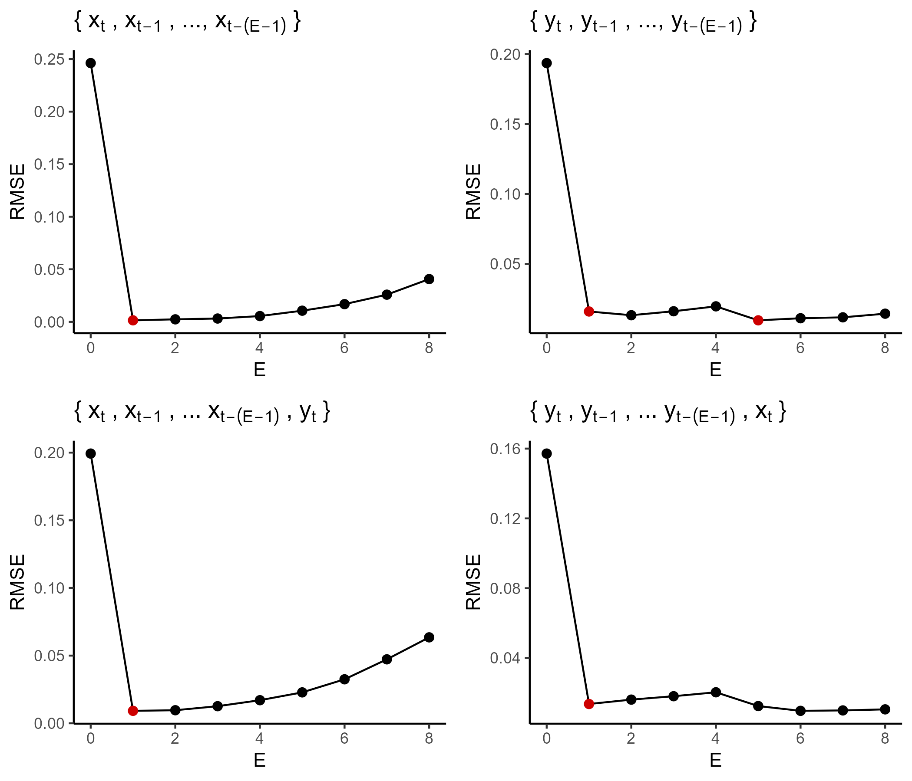
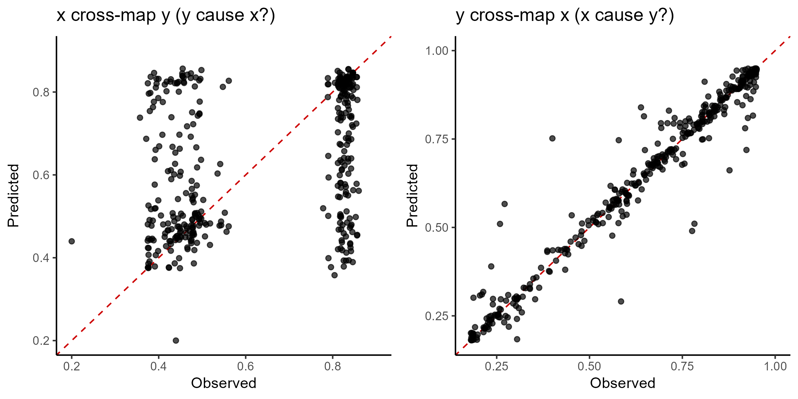
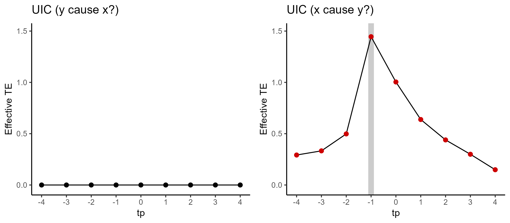
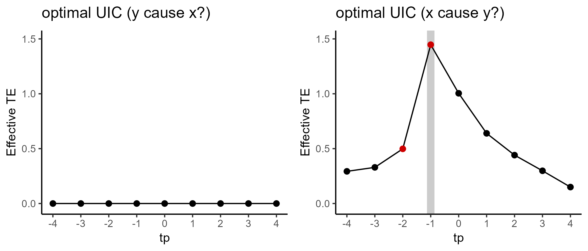

# rUIC : Unified Information-theoretic Causality for R

## rUICとは

rUIC は、時系列データを用いたノンパラメトリック因果推定法である **Unified Information-theoretic Causality (UIC)** をフリーソフト R で使えるように実装したパッケージです。

UIC と類似の因果推定法である **Transfer Entropy (TE, Schreiber 2000)** と **Convergent Cross Mapping (CCM, Sugihara _et al_. 2012)** の次のような利点を併せ持ちます。

- 因果に対する数学的な定義が明確で、推定量に一致性（データが多くなると真の値に近づいていく性質）がある。
- 線形なデータでも非線形なデータでも対応できる。
- 結果変数に対してノイズ頑健性があり、より少ない時点数で推定できる場合がある。
- 条件付き因果推定により、因果の直接／間接を統計的に区別できる（Frenzel & Pompe, 2007）。
- 計算を高速に行うことができる。

## パッケージの特徴

基本的には **rEDM** パッケージを踏襲したインターフェースをしていますが、誤解を少なくしたり拡張した解析を行ったりする目的で、引数名の変更や追加があります。

**<u>rEDM を使ったことがある方に向けての留意点</u>**

- UIC は因果の指標を計算する際に、CCM の「ライブラリデータを少なくする」数値的処理を必要としません。そのため、rUIC ではそれに関連した引数はありません。
- rEDM では自分自身でサロゲートデータを生成して _p_ 値を計算する必要がありましたが、rUIC ではパッケージ内で自動的に計算を行います。
- rUIC では使用する埋め込み次元を自動的に検討するラッパー関数（`uic.optimal`, `uic.marginal`）を用意しています。多数の因果を決まったプロトコルで計算する際には活用ください。
- Multispatial CCM (Clark _et al_. 2015) を行う際には `group` 引数にグループ（地点名など）を表す変数名を明示的に指定する必要があります。

## 実装されている関数

#### `simplex`

**埋め込み次元の検討**などに使います。シンプレックス写像を用いて、埋め込み次元（E）や埋め込みラグ（tau）が異なるモデルの予測力（Root Mean Squared Error; RMSE）を計算します。また、より低い埋め込み次元をもつ帰無モデルと比較することで、サロゲート法による _p_ 値を計算します（帰無モデルについては解析方法の一例で説明される `alpha` 引数について御覧ください）。

#### `uic`

**因果推定**に使います。クロス写像を用いて、指定された埋め込み次元（E）やラグ（tau）から、因果の指標である **transfer entropy**（te）を計算します。サロゲート法による _p_ 値も自動的に計算します。

#### `xmap`

クロス写像を用いたモデルの予測値を返します。`lib_var` 引数と `tar_var` 引数に同じ変数名を指定することで、シンプレックス予測を行うこともできます。

#### `uic.optimal`

因果推定において使用する埋め込み次元を自動的に検討するラッパー関数。因果の指標である te を計算するために、**最適な埋め込み次元**をひとつだけ使います。

#### `uic.marginal`

因果推定において使用する埋め込み次元を自動的に検討するラッパー関数。因果の指標である te を計算するために、モデル平均の考え方から（最適な埋め込み次元だけでなく）**指定したすべての次元**を使います。最適な埋め込み次元をもつモデルほど因果の指標の計算により大きな重みをもちます。

## インストール方法

Github から直接ダウンロードしてインストールを行います。
``` r
library(remotes)
remotes::install_github("yutakaos/rUIC")
```

## 因果推定を行うまでの解析方法の一例

#### 1. ライブラリの読み込み／データの生成
```r
# Load library
library(rUIC); packageVersion("rUIC") # v0.9.0

# simulate logistic map
tl <- 400  # time length
x <- y <- rep(NA, tl)
x[1] <- 0.4
y[1] <- 0.2
for (t in 1:(tl - 1)) {  # causality : x -> y
    x[t+1] = x[t] * (3.8 - 3.8 * x[t] - 0.0 * y[t])
    y[t+1] = y[t] * (3.5 - 3.5 * y[t] - 0.1 * x[t])
}
block = data.frame(t=1:tl, x=x, y=y)
```

<figure>

<figcaption> <b>Figure 1 | モデルから生成した時系列データ</b> <br> 赤線と青線は、それぞれ原因変数 <i>x</i> と結果変数 <i>y</i> の時系列データを表す。</figcaption>
</figure>
 
#### 2. シンプレックス写像による最適な埋め込み次元の決定

因果推定の埋め込み次元には「**原因変数を説明変数としてもつ多変量シンプレックス写像を用いて最も予測力の高かった次元に 1 を足した**」ものを使います。下記のコードでは、（CCM の手順で使用される）一変量シンプレックス写像 univeriate simplex projection と多変量シンプレックス写像 multivariate simplex projection の引数の指定の違いについて注意して御覧ください。

```r
# Univariate simplex projection
simp_x <- simplex(block, lib_var="x", E=0:8, tau=1, tp=1, alpha=0.05)
simp_y <- simplex(block, lib_var="y", E=0:8, tau=1, tp=1, alpha=0.05)

# Multivariate simplex projection
simp_xy <- simplex(block, lib_var="x", cond_var="y", E=0:8, tau=1, tp=1, alpha=0.05)
simp_yx <- simplex(block, lib_var="y", cond_var="x", E=0:8, tau=1, tp=1, alpha=0.05)

# Determine the optimal embedding dimension
Exy <- with(simp_xy, max(0, E[pval < 0.05])) + 1
Eyx <- with(simp_yx, max(0, E[pval < 0.05])) + 1
```

※ `alpha` 引数によって _p_ 値の計算に使用する帰無モデルの埋め込み次元を指定します。`alpha = NULL` のとき、対象となるモデルより１つ低い埋め込み次元を使用します。`alpha = 0.05` のように数値が指定されるとき、`E` で指定された埋め込み次元の中で、対象となるモデルより低い次元、かつ有意にシンプレックス写像の予測力を向上した次元（有意水準は alpha になる）を帰無モデルの埋め込み次元に使用します。

<figure>

<figcaption> <b>Figure 2 | シンプレックス写像の結果</b> <br> 
上列が一変量シンプレックス写像の結果、下列が多変量シンプレックス写像の結果。横軸と縦軸はそれぞれ埋め込み次元と予測力の指標（RMSE）を表す。</figcaption>
</figure>

#### 3. クロス写像による予測

クロス写像（やシンプレックス写像）によるモデル予測の結果も容易に得られます。

```r
xmap_xy <- xmap(block, lib_var="x", tar_var="y", E=Exy, tau=1, tp=-1)
xmap_yx <- xmap(block, lib_var="y", tar_var="x", E=Eyx, tau=1, tp=-1)
```

因果がある場合には Figure 3 の右図のように高い予測力が得られます。逆に、因果がない場合には Figure 3 の左図のように十分に予測ができません。この例の結果は「<i>x</i> から <i>y</i> への一方向の因果がある」ことを示唆しています。

<figure>

<figcaption> <b>Figure 3 | クロス写像からの予測値と観測値の比較</b> <br> 
左図が <i>x</i> を用いて <i>y</i> をクロス予測した結果、右図が <i>y</i> を用いて <i>x</i> をクロス予測した結果。横軸と縦軸はそれぞれ観測値と予測値を表す（赤色の点線は恒等線）。</figcaption>
</figure>

#### 4. UIC による因果推定

原因変数が結果変数に影響を与えるまでの時間のラグ（-tp）を変えて因果推定を行います（tp に**マイナス**がついていることに注意）。埋め込み次元（E）と埋め込みラグ（tau）は、シンプレックス写像で検討した値を使用します。

```r
uic_xy <- uic(block, lib_var="x", tar_var="y", E=Exy, tau=1, tp=-4:4)
uic_yx <- uic(block, lib_var="y", tar_var="x", E=Eyx, tau=1, tp=-4:4)
```

今回のデータでは <i>x</i> が一時点先の <i>y</i> に影響しているため、Figure 4 右図の結果では tp = -1 で最も高い因果の指標（TE）が得られています。

<figure>

<figcaption> <b>Figure 4 | UICによる因果推定の結果</b> <br> 
横軸は原因変数が結果変数に影響を与えるまでの時間のラグ（tp）、縦軸は因果の指標（te）を表す。赤点は有意に因果があったことを示す。
</figcaption>
</figure>

#### 5. 因果推定を行うためのラッパー関数

因果推定の実装が簡単になるよう、自動的に埋め込み次元を検討する２つのラッパー関数を用意しています。`uic.optimal`では、手順 2 と 4 を踏み、最適な埋め込み次元をひとつだけ使用して因果を推定します（Figure 4 と同じ結果が得られる）。`uic.marginal`では、モデル平均の考え方から指定した埋め込み次元をすべて使用して因果を推定します。

```r
# compute UIC using optimal embedding dimension
uic_opt_xy <- uic.optimal(block, lib_var="x", tar_var="y", E=0:8, tau=1, tp=-4:4)
uic_opt_yx <- uic.optimal(block, lib_var="y", tar_var="x", E=0:8, tau=1, tp=-4:4)

# compute UIC marginalizing embedding dimension
uic_mar_xy <- uic.marginal(block, lib_var="x", tar_var="y", E=0:8, tau=1, tp=-4:4)
uic_mar_yx <- uic.marginal(block, lib_var="y", tar_var="x", E=0:8, tau=1, tp=-4:4)
```

※ ラッパー関数を使わずにマニュアルで手順 2 と 4 を踏みことは、おかしな挙動をするデータの発見や解析のミス（探索する埋め込み次元が少なすぎる等）を防ぐのに役立つことがあります。初めてのデータを使用する際にはマニュアルで解析してみることをお勧めします。


<figure>

<figcaption> <b>Figure 5 | ラッパー関数を使用した因果推定の結果</b> <br> 
上列が uic.optimal の結果、下列が uic.marginal の結果。横軸は原因変数が結果変数に影響を与えるまでの時間のラグ（tp）、縦軸は因果の指標（te）を表す。赤点は有意に因果があったことを示す。
</figcaption>

## 関数で使用される引数

rUIC パッケージは、基本的に rEDM パッケージを踏襲したインターフェースをしています。多くの引数は rEDM パッケージでも使用されているので、充実した rEDM のチュートリアル (https://ha0ye.github.io/rEDM/index.html) を御覧いただくと理解に役立つかもしれません。

#### `block`
**共通｜**各列に時系列データをもつ「データフレーム」もしくは「行列」。

#### `lib`
**共通｜**アトラクターの再構築に使用されるデータを指定する２列の「行列」もしくは２要素の「ベクトル」。１列目がデータの開始時点を、２列目がデータの最終時点を表す。例えば、`lib = c(1,10)` であれば `block` の１から１０行目のデータを使用する。

#### `pred`
**共通｜**モデルの予測に使用されるデータを指定する２列の「行列」もしくは２要素の「ベクトル」。引数の形式については `lib` と同じ。

#### `group`
**共通｜**時系列データのグループ変数。`block` の列あるいは列名を指定する。デフォルトの `group = NULL` であれば、すべてのデータは同じグループに所属する。

#### `lib_var`
**共通｜**アトラクターの再構築に使用される変数（ライブラリ変数）。`block` の列あるいは列名を指定する。ここで指定された変数は「時間遅れ埋め込み」が行われる。

**simplex｜**指定された変数は（アトラクターの再構築だけでなく）予測にも使用される。

#### `tar_var`
**共通｜**予測に使用される変数（ターゲット変数）。`block` の列あるいは列名を指定する。

#### `cond_var`
**共通｜**アトラクターの再構築に使用される変数。`block` の列あるいは列名を指定する。ここで指定された変数は「時間遅れ埋め込み」が行われない。

#### `norm`
**共通｜**状態空間上のデータ間の Lp 距離を計算する際に使用される乗数。最大距離（muximum distance）を使用するときには `norm = -1` を指定する。デフォルトでは `norm = 2` を指定するが、外れ値の多いデータではより小さい `norm = 1` 等を用いるのがよい。

#### `E`
**共通｜**アトラクターの再構築に使用される埋め込み次元。

#### `tau`
**共通｜**アトラクターの再構築に使用される埋め込みラグ。例えば、（埋め込み次元が３の場合）`tau = k` だと時間遅れ埋め込みは { <i>x[t], x[t-k], x[t-2*k]</i> } となる。

#### `tp`
**共通｜**ターゲット変数が予測する先の時点数。simplex と uic で使い方が異なるので注意する。

**simplex｜**予測する先の時点数（基本的には**非負**の値）。短期予測をしたい場合には小さい値を、長期予測したい場合は大きい値を指定する。

**uic｜**原因変数が結果変数に影響を与えるまでの時間のラグ（基本的には**非正**の値）。ラッパー関数においても同じ。

#### `nn`
**共通｜**予測に使用される状態空間上の近傍数（rEDM における `num_neighbors` 引数）。「整数」か "e+1" を指定する。デフォルトの `nn = "e+1"` もしくは `nn = 0` のとき、埋め込み次元 `E` に１を足した値が近傍数に使用される。`nn = -1` のとき、すべてのデータを近傍に仕様する。

#### `alpha`
**simplex｜**帰無モデルの埋め込み次元の決定に使用される有意水準。デフォルトの `alpha = NULL` のとき、対象となるモデルより１つ低い埋め込み次元を使用する。`alpha = 0.05` のように数値を指定するとき、`E` で指定された埋め込み次元の中で、対象となるモデルより低い次元、かつ有意にシンプレックス写像の予測力を向上させた次元を帰無モデルの埋め込み次元に使用する（有意と考える水準に `alpha` の値を用いる）。

**uic.optimal｜**最適な埋め込み次元の決定に使用されるシンプレックス写像の `alpha` の値。simplex とは異なり、`alpha = NULL` は指定できない。

#### `num_surr`
**共通｜** _p_ 値の計算に使用されるサロゲートデータの生成数。`num_surr = 0` のとき、サロゲートデータは生成されず _p_ 値は計算されない。

#### `exclusion_radius`
**共通｜**特定のデータを近傍から排除するために使用される引数。ここで指定した値より近い時間のデータは近傍に使用されない。近傍に自身のデータを含めないためには、デフォルトの `exclusion_radius = NULL` もしくは `exclusion_radius = 0` を指定する必要がある。大きい値を指定するほど過剰適合を防げるが、使用できるデータ数が減少する。

#### `epsilon`
**共通｜**特定のデータを近傍から排除するために使用される引数。ここで指定した値より近い距離のデータは近傍に使用されない。大きい値を指定するほど過剰適合を防げるが、使用できるデータ数が減少する。

#### `is_naive`
**共通｜**近傍数によるバイアス補正を行わないかを指定する「論理型」引数。`is_naive = TRUE` であるとき、バイアス補正をしていない rEDM と同じ導出を行う。基本的には `is_naive = FALSE` を指定する。

#### `knn_method`
**共通｜**近傍を探索する方法を指定する引数。`knn_method = "KD"` では kd 木を用いた近傍探索を、`knn_method = "BF"` では全距離を計算する近傍探索（brute-force）を用いる。ある程度データ数が多いときには kd 木を用いた方が高速に近傍探索を行うことができる。

## 関数から出力される統計量

|  統計量 | |
| ---------| ---- |
| `E`      | 埋め込み次元 |
| `E0`     | 帰無モデルの埋め込み次元 |
| `tau`    | 埋め込みラグ |
| `tp`     | 予測先の時点数 |
| `nn`     | 近傍数 |
| `n_lib`  | アトラクターの再構築に使用されるデータ数 |
| `n_pred` | 予測に使用されるデータ数 |
| `rmse`   | モデルの予測力の指標（RMSE） |
| `te`     | 比較されるモデル間の情報量の差（TE） |
| `pval`   | 帰無仮説 TE > 0 を検定した _p_ 値 |
| `n_surr` | _p_ 値の計算に使用されたサロゲートデータの数 |
