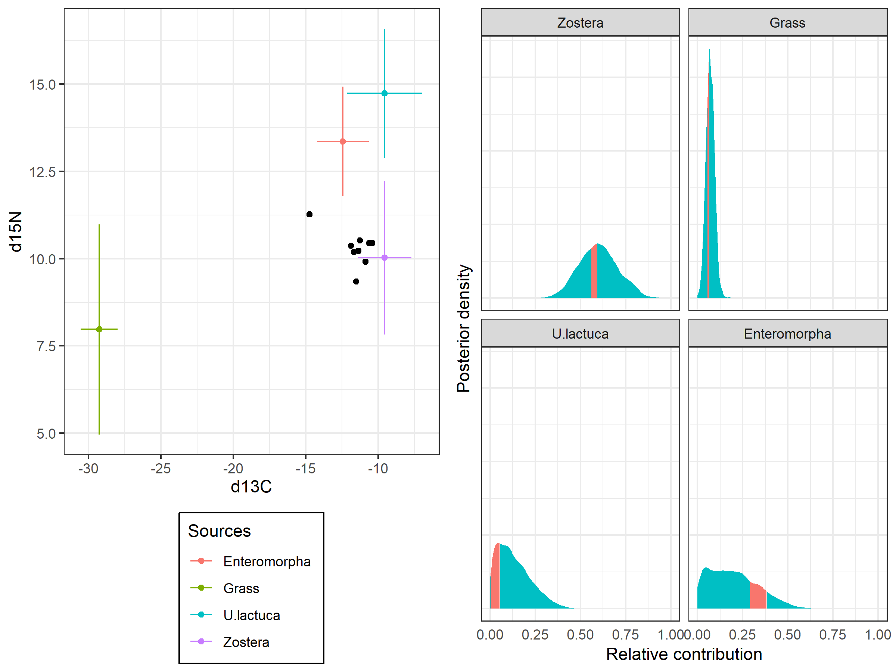

# siarbeta : Beta-dependent Stable Isotope Mixing Model

A tutorial for siarbeta package.

**Citation**:
Y. Osada, J. Matsubayashi, I.o Tayasu. (2021)
Diagnosing underdetermination in stable isotope mixing models.
*Plos one* 16: e0257818.

## Installation
```r
library(devtools)
devtools::install_github("yutakaos/archives/simm/siarbeta")
```

## Tutorial

### Load library and set data
```r
# Load libarary
library(siarbeta)

# Set data (Inger et al. 2006, Parnell et al. 2010)
mixture <- matrix(
    c( 10.22, 10.37, 10.44, 10.52, 10.19, 10.45,  9.91, 11.27,  9.34,
      -11.36,-11.88,-10.6 ,-11.25,-11.66,-10.41,-10.88,-14.73,-11.52),
    ncol=2, dimname=list(NULL, c("d15N","d13C")))
source_names <- c("Zostera","Grass","U.lactuca","Entermorpha")
stat_names   <- c("Mean_15N","SD_15N","Mean_13C","SD_13C")
sources <- matrix(
    c(6.488984470, 1.459463243, -11.17022768, 1.214956157,
      4.432160103, 2.268070895, -30.87984395, 0.641318210,
      11.19261280, 1.112438464, -11.17090004, 1.959330558,
      9.816279751, 0.827103932, -14.05701092, 1.172467672),
    ncol=4, byrow=TRUE, dimnames=list(source_names, stat_names))
correct <- matrix(
    c(3.54,0.74,1.63,0.63), nrow=4, ncol=4, byrow=TRUE,
    dimnames=list(source_names, stat_names)
)
concdep <- matrix(
    c(0.0297, 0.0097, 0.3593, 0.0561,
      0.0355, 0.0063, 0.4026, 0.0380,
      0.0192, 0.0053, 0.2098, 0.0327,
      0.0139, 0.0057, 0.1844, 0.1131),
    ncol=4, byrow=TRUE, dimnames=list(source_names, stat_names))
```

### Run MCMC
```r
# Ordinary SIAR
out_L = siarbeta(
    mixture, sources, correct, concdep, alpha = 1, beta = 1,
    error = "parnell", source_names = source_names,
    chains = 3, iters = 5000, burns = 1000, thins = 4)

# Beta-dependent SIAR
out_H = siarbeta(
    mixture, sources, correct, concdep, alpha = 1, beta = 1000,
    error = "parnell", source_names = source_names,
    chains = 3, iters = 5000, burns = 1000, thins = 4)

# Summary statistics
summary(out_L)
#                      Mean         SD          2.5%          50%       97.5%     rhat   mean_r2
# Zostera        0.59970605 0.10624537   0.399537936   0.59719530   0.8102002 1.000347 0.1858890
# Grass          0.07019535 0.02377007   0.024779325   0.06929327   0.1166252 1.001158 0.1215366
# U.lactuca      0.13130782 0.09348966   0.005846707   0.11301847   0.3465096 1.001306 0.1330593
# Enteromorpha   0.19879078 0.13265536   0.008563942   0.18469323   0.4851537 1.000873 0.3301500
# SD1            0.64726213 0.39427916   0.104439547   0.57393721   1.6030457 1.000000        NA
# SD2            1.02409361 0.54679174   0.218837011   0.94059419   2.2720622 1.001462        NA
# lp           -26.10691496 1.66110829 -30.268261223 -25.78067618 -23.9629372 1.000182        NA

summary(out_H)
#                      Mean          SD          2.5%          50%        97.5%     rhat   mean_r2
# Zostera        0.57560782 0.008385274   0.559376168   0.57550796   0.59261019 1.009336 0.6277728
# Grass          0.05774041 0.002534191   0.053211424   0.05767994   0.06306487 1.004999 0.7392251
# U.lactuca      0.02632429 0.015375535   0.001734123   0.02535515   0.05942069 1.005888 0.7282766
# Enteromorpha   0.34032748 0.024441781   0.288189375   0.34121254   0.38213397 1.007661 0.8440318
# SD1            0.01791682 0.009200850   0.003226429   0.01684612   0.03767967 1.000634        NA
# SD2            0.68406997 0.017655317   0.647955216   0.68419640   0.71707637 1.000356        NA
# lp           -23.50743517 0.008424708 -23.525708883 -23.50549092 -23.50184471 1.037301        NA

# Correlation plot
plot_corr(out_L[,1:4])
```
<figure>

<figcaption><i>Figure 1 | Correlation plot.</i></figcaption>
</figure>

### Diagnose underdetermination
```r
# Diagnose underdetermination
evaluate_ump(out_H)
#                      lower        upper       delta
# Zostera       5.585727e-01   0.59172433 0.033151640
# Grass         5.305615e-02   0.06271182 0.009655665
# U.lactuca     1.674532e-05   0.05427174 0.054254994
# Enteromorpha  2.909324e-01   0.38310595 0.092173571
# SD1           1.929180e-03   0.03496760 0.033038423
# SD2           6.474285e-01   0.71615196 0.068723415
# lp           -2.351821e+01 -23.50117919          NA

# Plot mixing isotope space
mixingspace(
    mixture, sources, correct, axis = 2:1,
    source_names  = source_names,
    element_names = c("d13C", "d15N") )

# Posterior density plot
plot_post(out_L, out_H, type = "source")
```
<figure>

<figcaption><i>Figure 2 | Isotopic mixing space and posterior density plot.</i></figcaption>
</figure>

